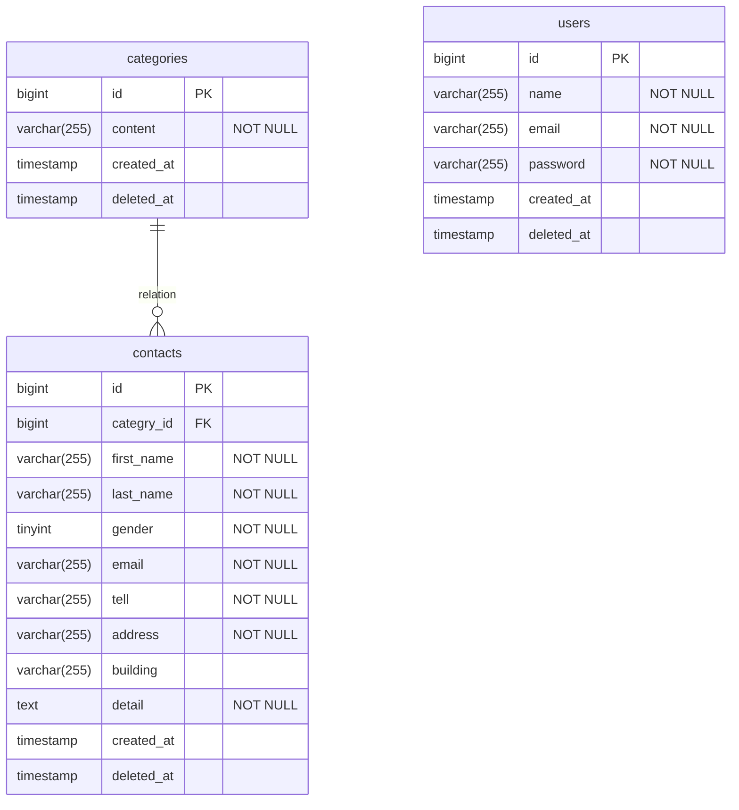

# test_contact-form

## 環境構築
### Dockerビルド
- git clone https://github.com/taotomo/test_contact-form.git
- docker-compose up -d --build

### Laravel環境構築
- docker-compose exec php bash
- composer install
- cp .env.example .env , 環境変数を適宜変更
- php artisan key:generate
- php artisan migrate
- php artisan db:seed

## 開発環境
  - お問い合わせ画面：http://localhost/  
  - ユーザー登録: http://localhost/register  
  - phpMyAdmin：http://localhost:8080/

## 使用技術(実行環境)
- PHP 8.2.29
- Laravel 8.83.27
- jquery 3.7.1.min.js
- MySQL 8.0.26
- nginx 1.21.1

## ER図

