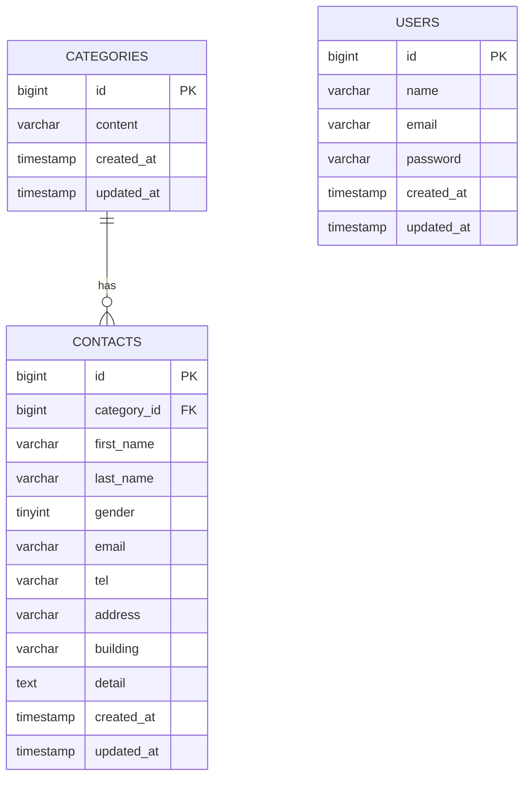

# ER Diagram (Mermaid)

以下はこのプロジェクト用に作成したテーブル仕様（`contacts` / `categories` / `users`）に基づく ER 図です。

- 仕様ソース: `src/database/migrations/2023_10_15_081426_create_contacts_table.php` と `docs/テーブル仕様書` に記載の項目
- 備考: `gender` は整数で保存 (1=男性,2=女性,3=その他)。`contacts.category_id` は `categories.id` の外部キー。

Mermaid をプレビューするには VSCode の Mermaid 拡張（例: `vstirbu.vscode-mermaid-preview`）を使って `docs/er-diagram.md` を開いてください。

説明:
- `CONTACTS.category_id` は `CATEGORIES.id` を参照する外部キーです。
- `USERS` テーブルは会員（管理者）用。サンプルシーダーで `admin@example.com` が追加されています。

もしこの図に `users` と `contacts` を結ぶ `user_id`（作成者や担当者）を追加したい場合は、知らせてください。Mermaid版はテキストで編集できるため、精密にフィールドを追記・変更できます。
