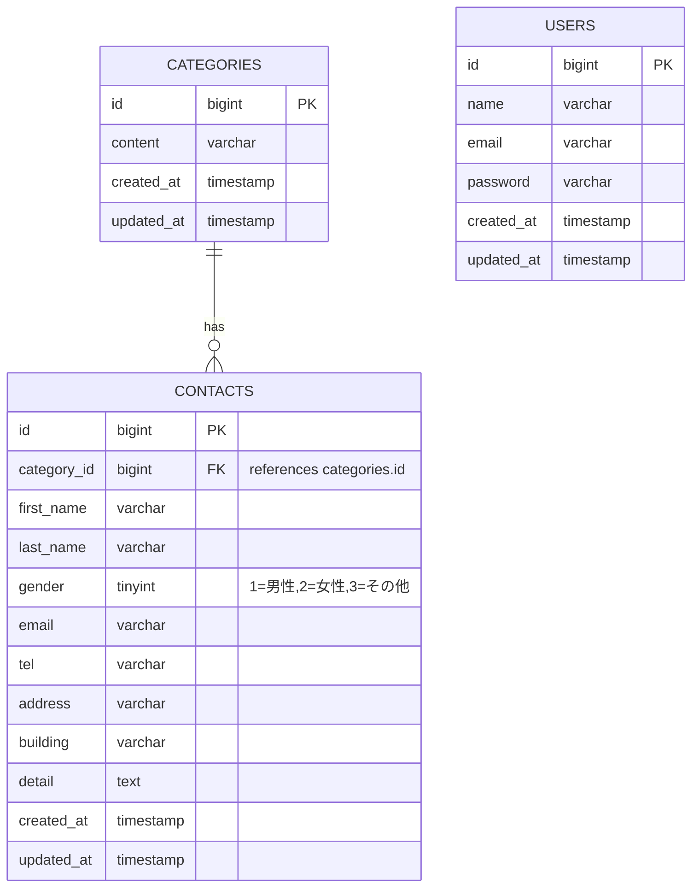

# ER図 (Mermaid)

以下はこのプロジェクト用に作成したテーブル仕様（`contacts` / `categories` / `users`）に基づくER図です。

- 仕様ソース: `src/database/migrations/2023_10_15_081426_create_contacts_table.php` と `docs/テーブル仕様書`
- 備考: `gender` は整数で保存 (1=男性,2=女性,3=その他)。`contacts.category_id` は `categories.id` の外部キー。

Mermaid をプレビューするには VSCode の Mermaid 拡張（例: `vstirbu.vscode-mermaid-preview`）を使ってこのファイルを開いてください。

説明:
- `CONTACTS.category_id` は `CATEGORIES.id` を参照する外部キーです。
- `USERS` テーブルは管理ユーザー用です（シーダーで `admin@example.com` を作成しています）。

必要であれば以下を追加できます:
- `contacts.user_id` を追加して問い合わせ作成者(担当)を紐付ける
- 各カラムに `NOT NULL` やインデックス情報を追記

どの情報を図に追加するか教えてください（例: `user_id` を追加して users と結びたい、NOT NULL を明示したい、など）。
